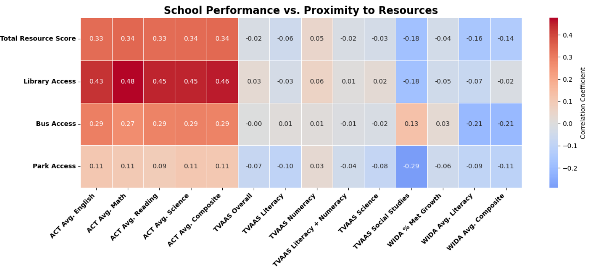
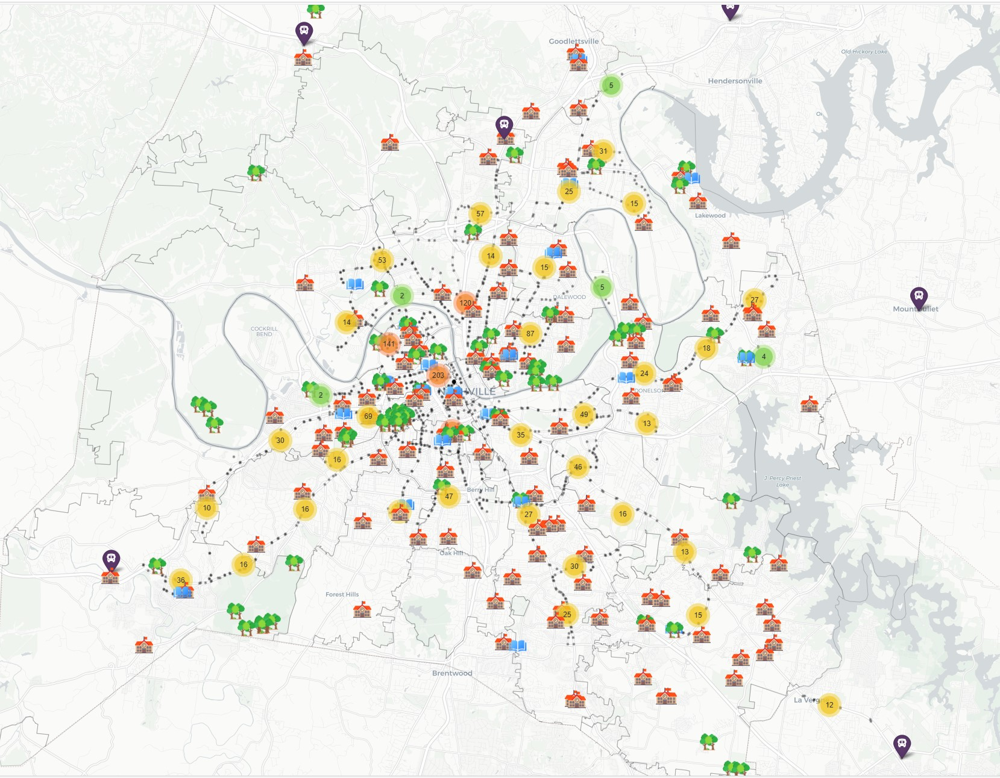

# Nashville Schools vs. Resources

## Table of Contents:
* [Project Overview](#project-overview)
* [Motivation](#motivation)
* [Initial Questions](#initial-questions)
* [Data Sources](#data-sources)
* [Limitations](#limitations)
* [Technologies Used](#technologies-used)
* [Analysis](#analysis)
* [Conclusions & Next Steps](#conclusions-and-next-steps)
* [Recommendations](#recommendations)
* [Dashboard](#dashboard)
* [Folium Map](#folium-map)
* [Repo Guide](#repo-guide)

## Project Overview 
This project investigates the public resources (libraries, parks, bus stops, etc.) in the **Metro Nashville area**, and if there is a connection between available _resources_ in a neighborhood and that neighborhood’s _public school performance_. 

As a long-term resident of Nashville and teacher, I wanted to understand how resources may or may not impact student performance. As an educator, I am always interested in the nearby resources available so I can connect families to them. This project focuses on school performance data and Nashville location data.  

## Motivation 
My motivations and inspirations for this project come from my experiences growing up in NYC, and my recent experiences as a teacher the Nashville area.  

Growing up in New York City, public resources felt endless. There are over 200 public libraries, and several public transit options (NYC public school students are also given free access to transit). Since there are so many resources within walking distance, and it is so much easier to travel to resources that are further away, everything is more accessible. Students and families are not as confined to their neighborhoods, and not having to rely on a car makes a huge difference. 

In Nashville, almost everyone relies on a car, which makes accessing resources more difficult. There is also a discrepancy between school performance and income/poverty levels in the area. Additionally, there are differences in how students get to school. Some schools offer buses, but if students choose an ‘option’, charter, or magnet school, they are often responsible for getting to school themselves. 

## Initial Questions 
1) How did MNPS schools perform in the 2023-2024 school year?
2) How many public resources (libraries, parks/community centers, bus stops) are there in the Metro Nashville area?
3) How close are schools to public resources? What is each school's 'resource score'?
4) _Is there a connection between a school's performance and its proximity to these public resources?_

## Data Sources

### School Performance Data (2023-2024)

All of the _School Performance Data_ came from the [TN Dept. of Education website](https://www.tn.gov/education/districts/federal-programs-and-oversight/data/data-downloads.html).

- ACT Data (School-level 2023-24)  
- English Language Proficiency Assessment (2023-2024, School Level)  
- Graduation Cohort Data (2023-24, School)  
- School Letter Grade (2023-24 A-F Letter Grade File)  
- TVAAS Composites (2023-24 Composite)  

**Additional School Data**

- [School Locations](https://www.arcgis.com/home/item.html?id=a25c1ef058a247cfa2636a396f3aaedd#data "Current as of 9/2025")  
- [TN Dept. of Education High-Poverty Schools](https://www.tn.gov/content/dam/tn/education/esser-planning-resources/High_Poverty_Schools_TN_2021-07-30.pdf) – I used this list to create a list of 'high-poverty' schools in MNPS for Python. _Note_: the most recent data I could find was from 2021.  

### Nashville Resources and Geographical Data

(current as of 9/2025)  

- [Bus Stop Locations](https://www.wegotransit.com/contact-us/developer-data-requests/ "Data request required")  
- [Library Facilities](https://data.nashville.gov/datasets/library-facilities/about)  
- [Parks Facilities](https://data.nashville.gov/datasets/park-facilities/about)  
- [Zip Code Boundaries](https://data.nashville.gov/datasets/zip-code-boundaries-1)  

## Limitations:
- One major limitation was that I was unable to locate a downloadable dataset that contained the locations of MNPS schools. I used the 'School Locations' table and entered the information manually on my schools info XLSX file.  
- For school performance data, I chose to use available data from the 2023-2024 school year. Obviously, this only represents one moment in time and does not show the full picture for schools. Ideally, I would love to include data from multiple years. This would be tricky due to different formatting and available data from the state of TN. 

## Technologies Used: 
**Excel**: The original data was from XLSX and CSV files. After cleaning and exploring on Python, I also returned to Excel for some final cleaning/spot-checking.

**Python**: I spent most of my time cleaning and exploring the data in Python.

**PowerBI**: After cleaning the data, I uploaded my final XLSX file to PowerBI to create a dashboard. 

## Analysis

I examined _public schools_ only (and left out charters - since they are not dependent on geographic location). There were 117 schools in total, with 70 elementary, 29 middle, and 18 high schools. Most schools are located in Nashville, but several are in other cities as well. It is also significant that 23% of schools were designated by the state as high-poverty schools.

**When I analyzed school performance, I found:** 
- most schools received a letter grade of a 'D' or 'F'
- the average WIDA (English Language Proficiency Assessment) composite score was 2.85/6
- the average TVAAS overall composite score was 3.42/5
- the average ACT composite score was 17.73/36

**Next, I examined public resources in the area:** 
- 21 libraries
- 64 parks and community centers
- 1631 bus stops 

**Then, I created a formula to calculate resource scores for each school.** Each school received 3 individual resource scores, based on proximity to a:
- library 
- bus stop
- park/community center (Nashville.gov data groups these together) 

Each score ranges from 0-3. 

_Example: A school earning **library score: 3** is within 1 mile of a library._

Then, I added the 3 scores together: 

**Library Score + Bus Score + Park Score = Total Resource Score (0-9)**

_A higher score = *closer to community resources*_

**Finally, I began to investigate connections between _school performance_ and _proximity to resources_. Overall, there was not a lot of correlation. However, there were some notable connections:** 
- ACT scores vs. library scores (+ correlation)
- ACT scores vs. total resource scores (+ correlation) 

## Conclusions & Next Steps
I was not surprised by the lack of correlation school performance and proxmity to resources. However, I was very surprised by how many schools are not near resources. 77/117 schools were more than 1 mile away from a library. I would love to know what we can do to support those students and families, since libraries serve as hubs for so many different resources and community events. It was also interesting to note that there were 24 schools within 1 mile of a library that earned a 'D' or an 'F'. I would also love to know what we can do to support those students and families and help them leverage nearby resources.  

If I were to build onto this project my next steps would be to: 

1) **Expand resource scores/map**: I would add neighborhood health centers, afterschool programs, food programs, and other resources

2) **Investigate more school performance data**: I would try to examine more performance metrics to get a more full picture

## Recommendations: 

My recommendation for MNPS and for the city of Nashville would be for them to really investigate school and community partnerships. 
- Are schools already utilizing community resources?
- Are schools already partnering with community organizations?
- If there are schools that do have strong existing partnerships, how can we replicate their systems across the district?
- How can we supporty schools in resource 'deserts'?
- How can we improve school performance in areas that are 'rich' in resources? 

## Dashboard 
I used PowerBI to make interactive dashboards and visuals. Check it out [here!](https://app.powerbi.com/view?r=eyJrIjoiMmFjNTBhMjgtNjJjYy00NTAxLTgyZWQtN2Q2YmQ2NDlkNzZhIiwidCI6IjEwMWRhNTg3LTE4NDMtNGY1Mi04YjhhLTE3YjA2OWM2NmQzMyIsImMiOjJ9)

Pages include: 

- **MNPS Overview**: general information about MNPS schools
- **Zooming In - ALL**: overall district performance in '23-'24 school year
- **Zooming In - HS**: overall district performance for high schools in '23-'24 school year 
- **Resources Overview**: general information about public resources in the Metro Nashville area
- **Resource Score**: information on how I calculated resource scores for each school
- **Heatmap**: correlation between school performance and proximity to resources 
- **Clusters**: filtering on MNPS data by Geographic Cluster

## Folium Map
Check out my **folium map**! It includes schools, libraries, parks/community centers, and bus stops. 

[Download it here to use the interactive version.](https://github.com/cfazio93/nashville_schools_vs_resources/blob/main/visuals/nashville_map.html) 

## Repo Guide
- The notebook I used for most of my analysis is in: _notebooks_ > _school_scores.ipynb_
- I used an additional notebook to create some visuals: _notebooks_ > _visuals_notebook.ipynb_
- If you want to see how I concatenated all of the geographical data, go to: _notebooks_ > _concat.ipynb_
- If you want to see my final spreadsheet: _notebooks_ > _final_spreasheet.xlsx_ 

